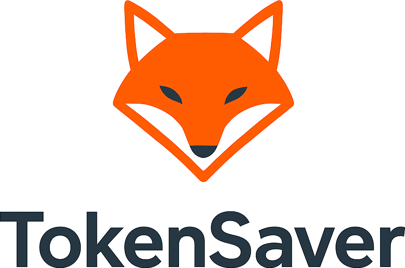
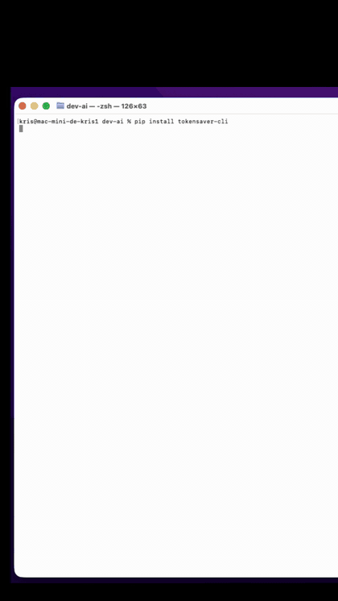
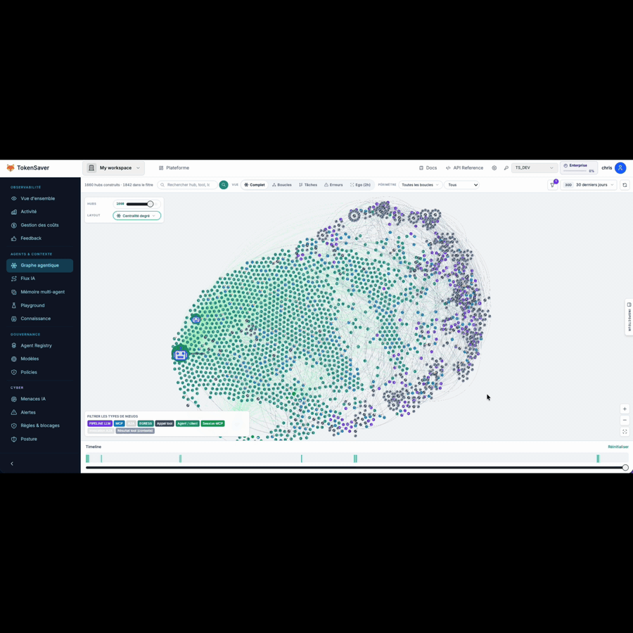

<div align="center">



### The control plane CLI for AI coding agents

**Route Claude Code, Cursor, and Codex through TokenSaver — Zero Trust governance, MCP tools, and Flux IA observability on every run.**

**Free signup · 15 free models · 600+ model catalog (Pro) · stdlib-only · MCP + Trust Gateway · Python ≥ 3.10**

[](https://github.com/tokensaver-ai/tokensaver-cli/stargazers)
[](https://pypi.org/project/tokensaver-cli/)
[](https://pepy.tech/project/tokensaver-cli)
[](https://pypi.org/project/tokensaver-cli/)
[](LICENSE)
[](https://github.com/tokensaver-ai/tokensaver-cli/actions)

[](https://tokensaver.fr)
[](https://platform.tokensaver.fr)
[](https://github.com/tokensaver-ai/tokensaver-cli/tree/main/docs)
[](https://pypi.org/project/tokensaver-sdk/)

**[Get started (60s)](#get-started-60-seconds)** · **[What you get](#what-you-get)** · **[Agent graph](#agent-to-agent-observability)** · **[Control plane](#control-plane--live-observability)** · **[Architecture](#architecture)** · **[Agents](#agent-compatibility)** · **[Docs](#documentation)** · **[llms.txt](llms.txt)**

</div>

---

<div align="center">

**See TokenSaver in action**

<table>
<tr>
<td align="center" valign="top" width="32%">

**CLI → Claude Code**

<a href="docs/assets/tokensaver-cli-demo.gif"></a>

<br/>

*Install → `login` → `route claude --launch`*

</td>
<td align="center" valign="top" width="68%">

<a id="agent-to-agent-observability"></a>

**Agentic graph**

<a href="docs/assets/graph-agentique.gif"></a>

<br/>

*Agent-to-agent handoffs in [Flux IA](https://platform.tokensaver.fr)*

</td>
</tr>
</table>

**[Sign up / Log in](https://platform.tokensaver.fr/en/login)** · **[Flux IA](https://platform.tokensaver.fr/en/login)** · **[Agentic graph](https://platform.tokensaver.fr/en/login)** · [Observability guide](#control-plane--live-observability)

</div>

---

Most coding agents talk to LLM providers directly: no shared audit trail, no inline PII guard, no org-wide FinOps — and every teammate wires MCP by hand.

**TokenSaver CLI** is the open-source on-ramp to the [TokenSaver control plane](https://tokensaver.fr): one command routes your agent through governed pipelines (cache, compression, RAG, PII, quotas) with full observability in the console.

> **Platform governance, not a local-only proxy.** Policies, RBAC, Agent Registry, and Flux IA live on [platform.tokensaver.fr](https://platform.tokensaver.fr). The CLI configures your laptop; the platform enforces and traces every call.

**Who it's for:**

- **Developers** shipping with Claude Code, Cursor, or Codex who want governance + observability without rewriting agent code
- **Platform teams** standardizing how agents connect to LLMs (OpenAI-compatible + Anthropic-compatible APIs, MCP tools, Trust Gateway)
- **FinOps / security** stakeholders who need PII filtering, quotas, and auditable runs — not just cheaper tokens
- **Free-plan explorers** — `tokensaver login` creates a workspace and API key in under a minute

**[Quick Start](#get-started-60-seconds)** · **[Why TokenSaver](#why-tokensaver)** · **[Command reference](#command-map)** · **[Contributing](CONTRIBUTING.md)**

---

## What you get

- **600+ models (Pro/BYOK)** — full Agent Registry; **Free plan includes 15 hosted models** (GLM, DeepSeek, GPT-OSS, Llama, …) with no provider API key → [models & Free plan](docs/models-and-free-plan.md)
- **`tokensaver route claude --launch`** — Claude settings, MCP tools (`mcp.tokensaver.fr`), Trust Gateway (`gateway.tokensaver.fr`), and the `tokensaver-router` plugin in one shot
- **Governed pipelines** — cache, compression, PII, RAG, and quotas follow **your API key policies** (runtime governance, not hard-coded in the CLI)
- **Flux IA** — `tokensaver flows` lists recent runs; `tokensaver flows --open` jumps to the console dashboard
- **Agent Registry** — `tokensaver approve` / `tokensaver use` for zero-trust model catalog (fixes 403 on quarantined models)
- **MCP slash commands** — `/tokensaver-router:quota`, `:flows`, `:cache`, `:models`, … inside Claude Code
- **Clean undo** — `tokensaver unroute claude` restores backed-up config files
- **Zero runtime deps** — stdlib only; `pip install tokensaver-cli` and go

Companion library: **[`tokensaver-sdk`](https://pypi.org/project/tokensaver-sdk/)** for `POST /pipelines/run`, chat sessions, and programmatic API access.

---

## Why TokenSaver

| | Direct provider API | Local proxy only | **TokenSaver CLI** |
| --- | --- | --- | --- |
| **Setup** | Per-provider keys | Manual env / config | `login` + `route claude` |
| **Governance** | Provider defaults | Local rules | Platform policies + RBAC |
| **PII / audit** | DIY | Varies | Inline pipeline + traces |
| **Observability** | Provider dashboard | Local logs | **Flux IA** end-to-end |
| **MCP** | Wire yourself | Partial | Tools + Gateway pre-wired |
| **FinOps** | Per-account billing | None | Quotas, budgets, run detail |
| **Model catalog** | Open access | N/A | **Agent Registry** (zero-trust) |

TokenSaver adds a **hosted trust layer** (governance, registry, observability) while keeping the OSS CLI free and MIT-licensed.

---

## Architecture

```text
 Claude Code · Cursor · Codex · LangChain · n8n · your app
        │  prompts · tool calls · MCP
        ▼
 ┌─────────────────────────────────────────────────────────┐
 │  tokensaver CLI  (local — ~/.config/tokensaver/)       │
 │  login · route · models · approve · doctor · flows      │
 └─────────────────────────────────────────────────────────┘
        │  Bearer ts_…  ·  OpenAI / Anthropic-compatible
        ▼
 ┌─────────────────────────────────────────────────────────┐
 │  TokenSaver control plane  (SaaS · EU-ready)          │
 │  ─────────────────────────────────────────────────────  │
 │  Cache → RAG → Compression → PII → LLM → Audit        │
 │  MCP tools · Trust Gateway · Agent Registry · FinOps    │
 └─────────────────────────────────────────────────────────┘
        │
        ▼
 LLM providers  (OpenRouter · Anthropic · OpenAI · Mistral · …)
```

**SaaS endpoints (default after `tokensaver login`):**

| Surface | URL |
| --- | --- |
| **Control plane (console)** | [platform.tokensaver.fr](https://platform.tokensaver.fr) — [sign up](https://platform.tokensaver.fr/en/signup) · [log in](https://platform.tokensaver.fr/en/login) |
| API | `api.tokensaver.fr` |
| MCP tools | `mcp.tokensaver.fr/mcp` |
| Trust Gateway | `gateway.tokensaver.fr/mcp` |
| **Flux IA** (live pipeline runs) | `platform.tokensaver.fr/en/{workspaceId}/dashboard?tab=flows` — or `tokensaver flows --open` |
| **Agentic graph** (multi-agent audit) | `platform.tokensaver.fr/en/{workspaceId}/execution-graph?period=7d` |

Typical pipeline savings on the platform: **~45% fewer tokens** (cache + compression + routing) — see [tokensaver.fr](https://tokensaver.fr).

---

## Control plane & live observability

The CLI routes traffic; the **TokenSaver control plane** shows every governed run in real time.

| Goal | How |
| --- | --- |
| **Create account / log in** | [platform.tokensaver.fr/en/signup](https://platform.tokensaver.fr/en/signup) or […/en/login](https://platform.tokensaver.fr/en/login) — same email as `tokensaver login` |
| **Flux IA** — pipeline steps, cache, PII, LLM, MCP | After `tokensaver login`: `tokensaver flows --open` (opens your workspace Flux IA tab) |
| **Agentic graph** — agent-to-agent handoffs, tool runs, audit trail | Console sidebar → **Agentic graph**, or `https://platform.tokensaver.fr/en/{workspaceId}/execution-graph?period=7d` |
| **Latest run deep link** | `tokensaver flows` prints the URL with `flowId=…` when a recent run exists |

```bash
tokensaver login              # saves ts_… key + workspace_id locally
tokensaver route claude --launch
# send a message in Claude Code, then:
tokensaver flows --open       # Flux IA in the browser (real-time)
tokensaver whoami             # email, plan, workspace id
```

Use the **same email** in the browser as `tokensaver whoami`. In the console sidebar: **Flux IA** for step-by-step runs, **Agentic graph** for the multi-agent canvas (as in the demo above).

Docs: [Observability (this repo)](#control-plane--live-observability) · [Product overview](https://tokensaver.fr) · [Console](https://platform.tokensaver.fr)

---

## Get started (60 seconds)

```bash
# 1 — Install (stdlib only)
pip install -U tokensaver-cli

# 2 — Free signup or sign-in → ts_… key saved locally
tokensaver login

# 3 — Route Claude Code and launch
tokensaver route claude --launch

# 4 — Verify + open Flux IA
tokensaver doctor --claude
tokensaver flows --open
```

Credentials: `~/.config/tokensaver/credentials.json` (`0600`).  
`TOKENSAVER_API_KEY` overrides the file when set.

**Self-host:** append `--local` on commands (API `:8000`, MCP `:8787/mcp`, gateway `:8788/mcp`).

---

## Agent compatibility

| Agent | `tokensaver route` | Notes |
| --- | --- | --- |
| **Claude Code** | ✅ `--launch` | Full: settings + MCP + plugin + optional `--with-fs` |
| **Cursor** | ✅ | Writes `.cursor/mcp.json` + Override URL steps |
| **OpenAI Codex** | ✅ `--launch` | Exports `OPENAI_BASE_URL` + key |
| **Generic proxy** | ✅ `route proxy` | Prints env for any OpenAI-compatible client |
| **MCP only** | ✅ `route mcp` | Tools + gateway entries without agent launch |

**Claude Code flags:** `--scope user|project|local` · `--profile cheap|default|strong` · `--model provider/model` · `--with-fs` · `--no-plugin` · `--local`

Undo: `tokensaver unroute <claude|cursor|codex|proxy|mcp>`

---

## When to use · When to skip

**Great fit if you…**

- run Claude Code / Cursor daily and want one command to wire MCP + governance
- need Flux IA traces (tool calls, cache, PII steps) without building observability yourself
- want Free-tier exploration with a real control plane, not just a API key passthrough

**Skip if you…**

- need 100% offline / air-gapped with no SaaS (use `--local` self-host)
- only want local token compression with no platform
- cannot send prompts through a governed API (strict data residency without self-host)

---

## Command map

```text
Auth           login · logout · whoami · keys list|create|revoke
Models         models · use · profiles · approve · catalog
Observability  flows · status
Route          route <claude|cursor|codex|proxy|mcp> · unroute …
Health         doctor [--claude] [--local]
```

<details>
<summary><strong>Auth & keys</strong></summary>

| Command | Purpose |
| --- | --- |
| `tokensaver login` | Interactive signup / sign-in |
| `tokensaver login --email you@acme.com --signup -y` | Non-interactive signup |
| `tokensaver login --key ts_…` | Import existing key |
| `tokensaver login --local` | Self-host (`localhost:8000`) |
| `tokensaver logout` | Remove local credentials |
| `tokensaver whoami` | Email, plan, key prefix, Flux IA link |
| `tokensaver keys list` | List API keys (JWT required) |
| `tokensaver keys create --name CLI --use` | Create + set default key |
| `tokensaver keys revoke <id>` | Revoke a key |

</details>

<details>
<summary><strong>Models & Agent Registry</strong></summary>

| Command | Purpose |
| --- | --- |
| `tokensaver models` | Profiles + **plan-filtered catalogue** (15 on Free, 600+ on Pro) |
| `tokensaver use <cheap\|default\|strong\|provider/model>` | Sticky model + approve + rewrite settings |
| `tokensaver approve [--current]` | Approve model in registry (zero-trust 403 fix) |
| `tokensaver catalog list\|pending\|approve <ref>` | Registry admin |

**Free plan:** 15 hosted OpenRouter models — see [docs/models-and-free-plan.md](docs/models-and-free-plan.md). Default profile → `openrouter/openai/gpt-oss-20b`. Override: `TOKENSAVER_PLAN=free`.

</details>

<details>
<summary><strong>Claude plugin slash commands</strong></summary>

Installed by `route claude` → skill `tokensaver-router`:

| Slash | Action |
| --- | --- |
| `/tokensaver-router:models` | List models + profiles |
| `/tokensaver-router:use` | Switch sticky model |
| `/tokensaver-router:flows` | Flux IA + recent runs |
| `/tokensaver-router:quota` | Key + quota overview (MCP) |
| `/tokensaver-router:cache` | Cache stats (MCP) |
| `/tokensaver-router:doctor` | Health checks |

</details>

<details>
<summary><strong>Environment variables</strong></summary>

```bash
export TOKENSAVER_API_KEY=ts_…
export TOKENSAVER_MODE=local          # or --local on commands
export TOKENSAVER_API_URL=http://localhost:8000
export TOKENSAVER_MCP_URL=http://localhost:8787/mcp
export TOKENSAVER_GATEWAY_URL=http://localhost:8788/mcp
export TOKENSAVER_CONSOLE_URL=http://localhost:3000
export TOKENSAVER_NO_BANNER=1         # hide ASCII banner on CLI start
```

</details>

---

## Documentation

| In this repo | Related |
| --- | --- |
| [docs/quickstart.md](docs/quickstart.md) | [Product](https://tokensaver.fr) · [Console / Flux IA](https://platform.tokensaver.fr) |
| [docs/models-and-free-plan.md](docs/models-and-free-plan.md) | [PyPI `tokensaver-cli`](https://pypi.org/project/tokensaver-cli/) |
| [docs/claude-code.md](docs/claude-code.md) | [Anthropic Claude Code](https://docs.anthropic.com/en/docs/claude-code) |
| [docs/open-models-glm.md](docs/open-models-glm.md) | GLM 4.7 Flash — optional open model on Free |
| [examples/](examples/) | [PyPI `tokensaver-sdk`](https://pypi.org/project/tokensaver-sdk/) |
| [docs/README.md](docs/README.md) | [GitHub docs tree](https://github.com/tokensaver-ai/tokensaver-cli/tree/main/docs) |

**Examples (shell):**

```bash
./examples/01-login-and-route.sh      # SaaS login + route
./examples/02-local-selfhost.sh       # localhost stack
./examples/03-glm-open-model.sh       # Free plan + GLM 4.7 Flash
LAUNCH_CLAUDE=1 ./examples/03-glm-open-model.sh   # also launch claude
```

**AI agents / LLMs:** read [`llms.txt`](llms.txt) in this repo for a compact index.

---

## TokenSaver for teams

The **OSS CLI** is built for individual developers: install, login, route your agent in minutes — free and MIT-licensed.

Running org-wide governance, SSO, centralized policies, and fleet FinOps across every team is what **[platform.tokensaver.fr](https://platform.tokensaver.fr)** and [tokensaver.fr](https://tokensaver.fr) enterprise plans are for.

→ [Request a demo](https://tokensaver.fr) · [Early Adopter program](https://tokensaver.fr)

---

## Contributing

Issues and stars welcome on this repo. Source of truth for releases is the private monorepo; this repository is a **public mirror** synced via `scripts/sync-oss-cli.sh`.

See [CONTRIBUTING.md](CONTRIBUTING.md) · [SECURITY.md](SECURITY.md) · [CHANGELOG.md](CHANGELOG.md)

```bash
git clone https://github.com/tokensaver-ai/tokensaver-cli.git
cd tokensaver-cli
python -m venv .venv && source .venv/bin/activate
pip install -e ".[dev]" && pytest -q
```

---

## License

MIT — see [LICENSE](LICENSE).

---

<div align="center">

[](https://star-history.com/#tokensaver-ai/tokensaver-cli&Date)

**[⭐ Star us on GitHub](https://github.com/tokensaver-ai/tokensaver-cli)** · **[tokensaver.fr](https://tokensaver.fr)**

</div>
